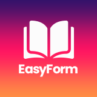

## About Easyform

Easyform is a specialised elearning plateform giving the opportunity to anyone to take or offer courses online.
The app has been developped with Laravel Framework version 7.28.3

## How to install

Step 1 - clone the project
run git clone https://github.com/pegase91/easyform.git

Step 2 - update composer and npm
run composer update
run npm install

Step 3 - create an account in udemy and fill the form in the below link :
https://www.udemy.com/user/request-api-client-popup/?display_type=popup
Nb : You will receive your api keys under 48 hours.

Step 4 - create a stripe account, signin and get the public and private keys with the link below :
https://www.udemy.com/user/request-api-client-popup/?display_type=popup

Step 5 : fill .env file of easyform with the required informations as below :

APP_KEY=YOUR_APP_KEY
DB_DATABASE=YOUR_DATABASE_NAME

STRIPE_PUBLIC_KEY=YOUR_STRIPE_PUBLIC_KEY
STRIPE_PRIVATE_KEY=YOUR_STRIPE_PRIVATE_KEY

UDEMY_CLIENT_ID=YOUR_CLIENT_ID
UDEMY_CLIENT_SECRET=YOUR_CLIENT_SECRET

Step 6 - lunch the project :
run php artisan  serve

Enjoy ! 

## Contributing

Thank you for considering contributing to the easyform plateform ! The contribution guide can be found in the [Laravel documentation](https://laravel.com/docs/contributions).

## Code of Conduct

In order to ensure that the Laravel community is welcoming to all, please review and abide by the [Code of Conduct](https://laravel.com/docs/contributions#code-of-conduct).

## Security Vulnerabilities

If you discover a security vulnerability within Laravel, please send an e-mail to Taylor Otwell via [taylor@laravel.com](mailto:taylor@laravel.com). All security vulnerabilities will be promptly addressed.

## License

The Laravel framework is open-sourced software licensed under the [MIT license](https://opensource.org/licenses/MIT).
